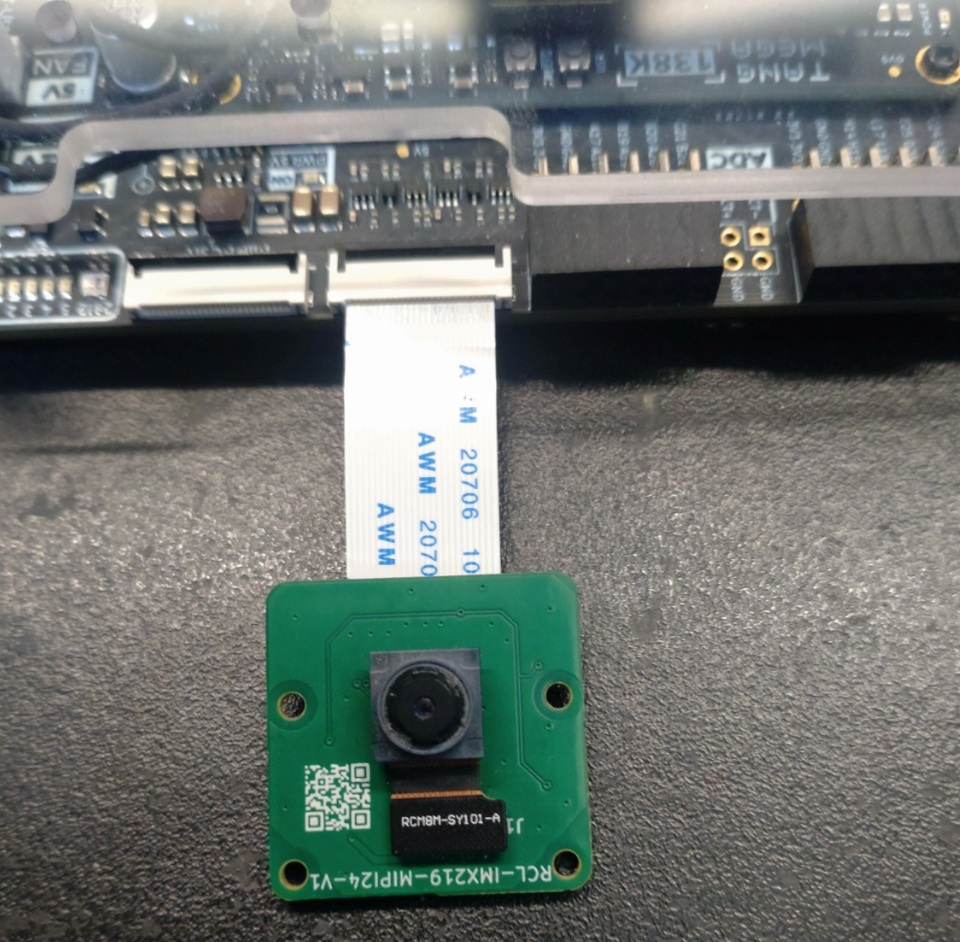
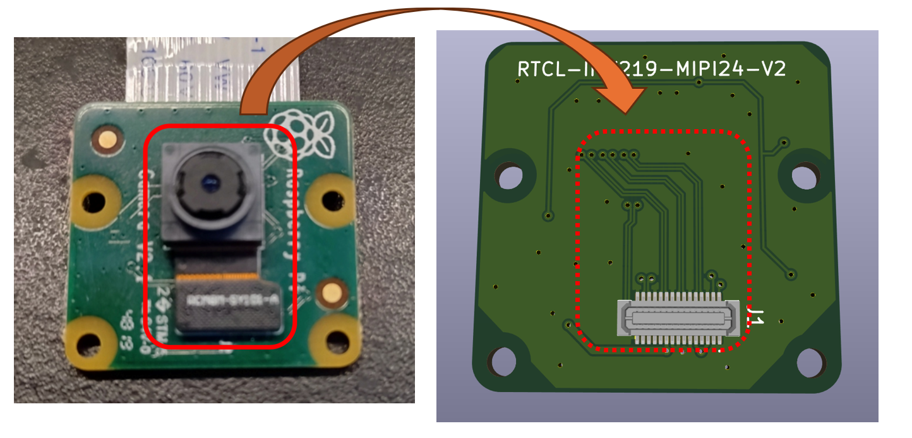

# Tang Mega 138K Pro Dock 用 IMX219 MIPI 変換基板 回路図

## 概要

[Raspberry Pi Camera V2](https://raspberry-pi.ksyic.com/main/index/pdp.id/144/pdp.open/144) のベース基板を入れ替えて、Sipeed さんの [Tang Mega 138K Pro Dock](https://wiki.sipeed.com/hardware/en/tang/tang-mega-138k/mega-138k-pro.html) に繋ぐための変換基板です。

Sipeed さんの独自仕様と思われる 24pin の MIPI コネクタで Sonyさんの IMX219 センサーを利用可能にします。

## 回路図

回路図は[こちら](imx219_mipi24.pdf)です。

## 免責事項

本設計データは、研究開発用の試作実験に用するものであり、利用に際して発生した如何なる損害も作者は補償いたしませんので予めご了承ください。

## ライセンス(License)

回路図のみ MIT ライセンスにて配布いたします。

## BOOTH への出品

- [Tang Mega 138K Pro Dock 用 IMX219 MIPI 変換基板](https://rtc-lab.booth.pm/items/7095235)
- [Tang Mega 138K Pro Dock 用 IMX219 MIPI カメラ基板(イメージセンサー付き)](https://rtc-lab.booth.pm/items/7132890)

当方からご購入いただいた基板は商用/非商用ともに自由にお使いいただけます。

## 作者情報

渕上 竜司(Ryuji Fuchikami)
[リアルタイムコンピューティング研究所](https://rtc-lab.com/)
